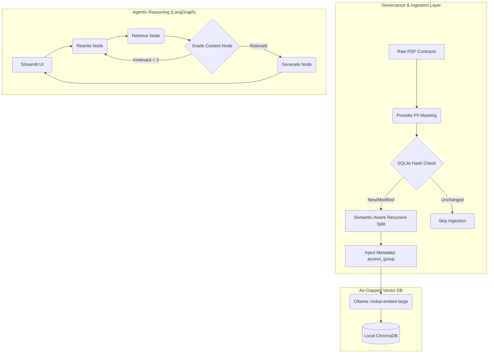

# Enterprise Deal Analytics & Risk Extraction Pipeline (v1.0)

A production-ready, agentic RAG pipeline designed to automate the extraction of critical financial terms and assess risks in unstructured corporate contracts. 

Built with 100% air-gapped security and strict data governance for the financial services sector.

## Core Architecture


## Key Capabilities
* **Governance Layer:** Integrated **SQLite Hash Tracking** ensures incremental ingestion, skipping unchanged files to optimize local GPU resources.
* **Semantic-Aware Recursive Strategy:** Utilizes an optimized splitting logic (800/150) with paragraph and sentence-level awareness to ensure 100% reliability with local LLM context windows.
* **Agentic Self-Correction:** Implements a **LangGraph State Machine** that autonomously grades retrieval quality and rewrites queries until a relevant context is found.
* **RBAC Groundwork:** Every document chunk is injected with `access_group` metadata at the ingestion stage for future enterprise scaling.

## 🛠️ Getting Started

### 1. Prerequisites
*   **Python:** 3.10 or higher.
*   **Local LLM:** [Ollama](https://ollama.com/) must be installed and running.
*   **Models:** `ollama pull llama3.1` and `ollama pull mxbai-embed-large`.

### 2. Installation & Setup
```bash
git clone https://github.com/mkazemicent/fin-doc-rag-pipeline.git
cd fin-doc-rag-pipeline

# Create and activate virtual environment
python -m venv venv
source venv/bin/activate

# Install dependencies
pip install -r requirements.txt
python -m spacy download en_core_web_lg

# Initialize local configuration
cp .env.example .env.local  # Update OLLAMA_BASE_URL if needed
```

### 3. Data Directory Initialization
The data folders are ignored by Git to ensure sensitive contracts never leave your local environment. You must create them manually:
```bash
mkdir -p data/raw data/processed data/chroma_db
```

## 🚀 Bulk Processing Guide
For processing large batches of PDF contracts, use the CLI pipeline which leverages incremental sync:

1.  **Stage 1: PII Masking & Extraction**
    Redacts sensitive info and extracts text into `data/processed/`.
    ```bash
    python -m src.ingestion.document_processor
    ```

2.  **Stage 2: Semantic Chunking & Vector Indexing**
    Hashes, chunks, and embeds documents into ChromaDB. Skips unchanged files.
    ```bash
    python -m src.rag.vector_store
    ```

## 📂 System Usage
*   **Standard Workflow:** Place your PDFs in `data/raw/`, run the two bulk processing commands above, and then launch the dashboard.
*   **Interactive Dashboard:** `streamlit run app/main.py` (Supports single-file uploads).
*   **Validation:** `python -m pytest --cov=src tests/` (71% Coverage).
*   **RAGAS Evaluation:** `python scripts/evaluate_ragas.py`.

---
*Developed for Canadian Financial Services Compliance. Air-Gapped. Secure. Semantic.*
