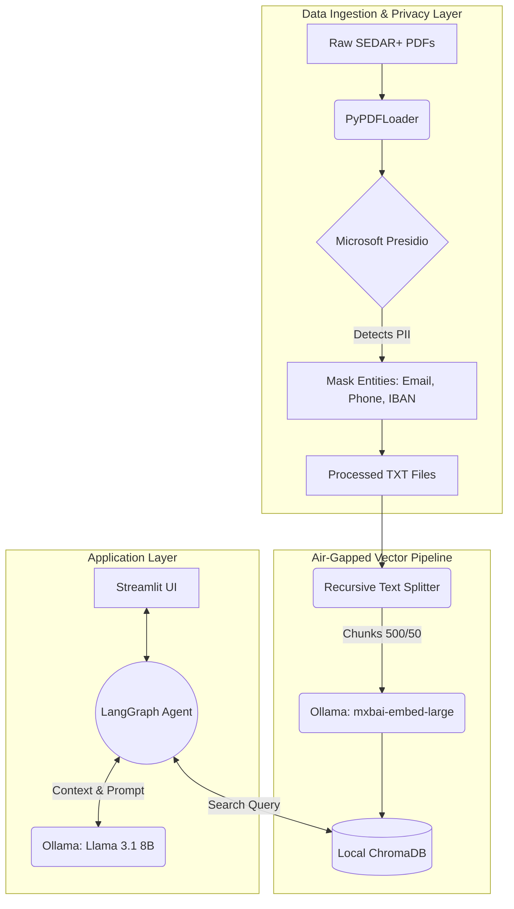
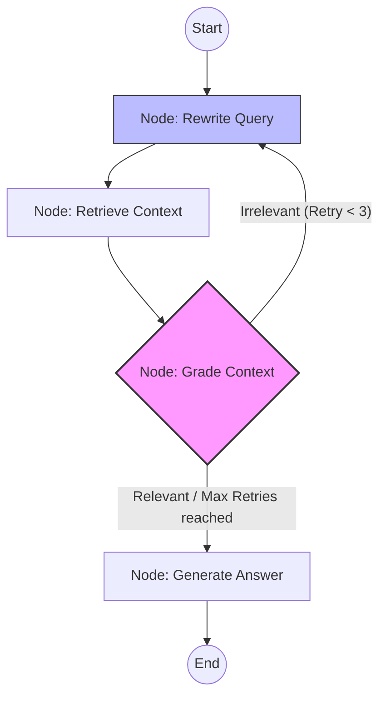
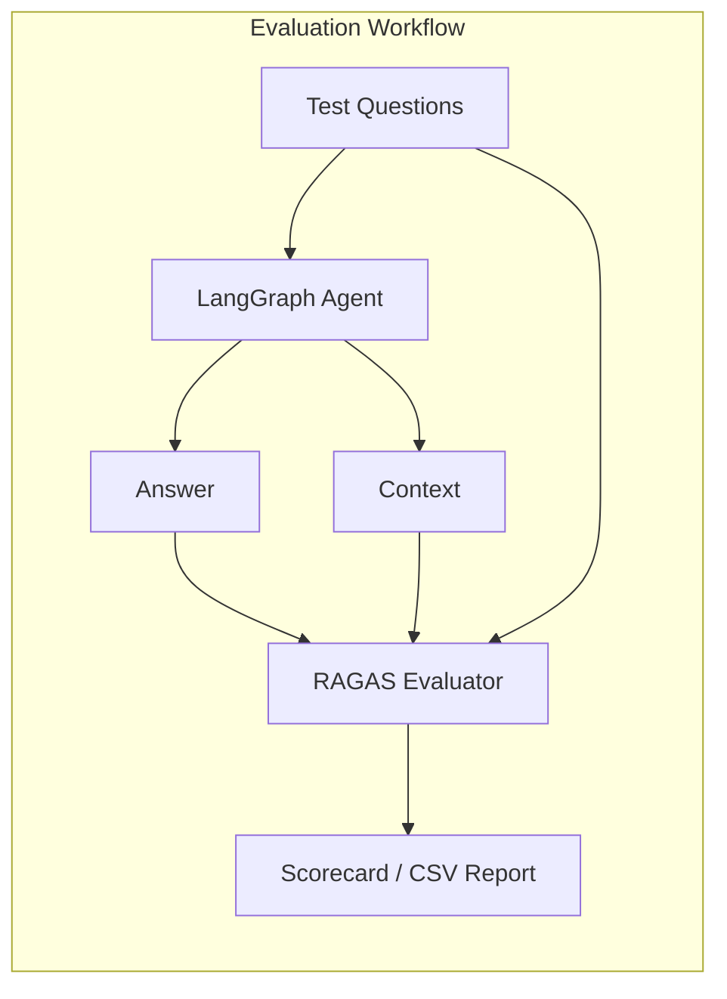

# Enterprise Deal Analytics & Risk Extraction Pipeline

A production-ready, agentic RAG pipeline designed to automate the extraction of critical financial terms and assess risks in unstructured corporate contracts (e.g., Syndicated Loans, ISDA Agreements). 

Built with strict data privacy considerations for the Canadian financial services sector.

## The Business Problem
Processing complex, unstructured deal documents manually is time-consuming and prone to human error. Missing a conflicting maturity date or a poorly structured liability clause introduces significant institutional risk. 

## The Solution
This pipeline utilizes an Agentic Retrieval-Augmented Generation (RAG) architecture to ingest PDF contracts, completely mask Personally Identifiable Information (PII), and deploy an autonomous AI agent to extract terms, flag missing clauses, and generate stakeholder-ready summaries. 

## Core Architecture

## Advanced Agentic Features

### 🔄 Dynamic Routing & Self-Correction
This pipeline implements an advanced **LangGraph State Machine** to ensure high-quality information retrieval. If the initial search results are deemed irrelevant by the **Context Grader**, the agent automatically rewrites the search query and attempts a more focused retrieval (up to 3 times).

### 📊 Automated Evaluation (RAGAS)
To maintain the highest standards of accuracy for financial document analysis, we utilize the **RAGAS** framework. This allows us to mathematically track:
*   **Faithfulness:** Does the answer only use information from the retrieved context?
*   **Answer Relevancy:** How pertinent is the answer to the user's original query?

## Key Features
* **Compliance-First Ingestion:** All documents are passed through a zero-trust PII masking layer before any data is embedded or sent to an LLM.
* **Agentic Retrieval:** Utilizes LangGraph to give the AI specific "tools" (Term Extractor, Risk Assessor) and a self-correction loop.
* **Automated Risk Red-Flagging:** Automatically cross-references extracted dates and financial figures to highlight term mismatches.

## 🚀 To-Do / Roadmap
- [ ] **Hybrid Search:** Implement BM25 (keyword search) alongside Vector search to guarantee exact document ID retrieval.
- [ ] **Agentic / Semantic Chunking:** Replace fixed splitting with an NLP model to dynamically split chunks based on meaning.
- [X] **Role-Based Access Control (RBAC):** Implement security models for isolating deal access between analyst teams.
- [X] **Export to Memo:** Add a feature for analysts to download generated insights as structured memos.
- [ ] **Containerization:** Finalize Docker deployment for secure, isolated environments.

---
*Developed for Canadian Financial Services Compliance.*
