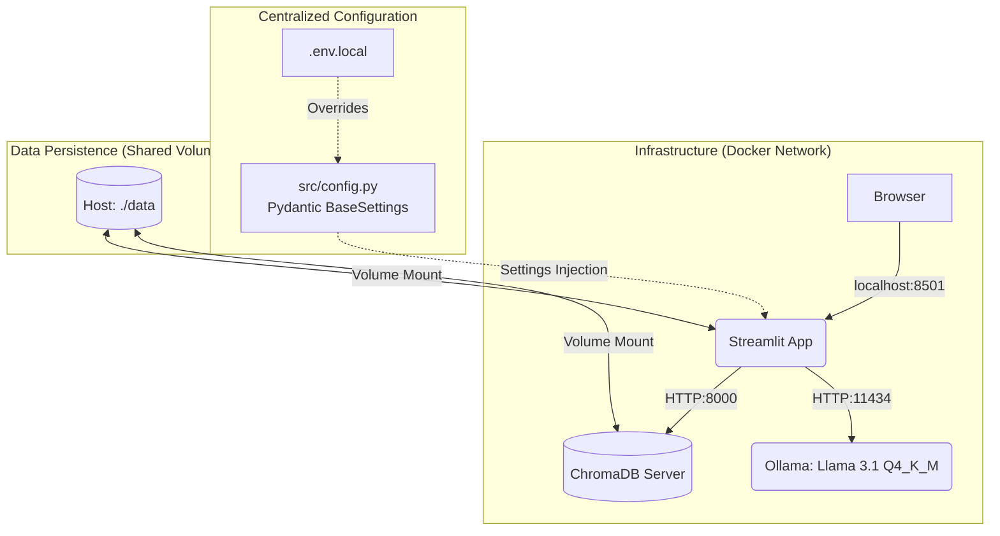
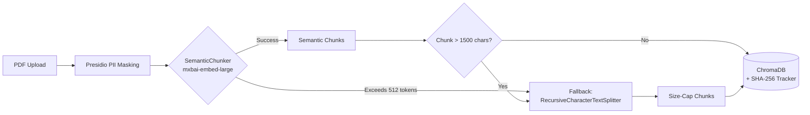
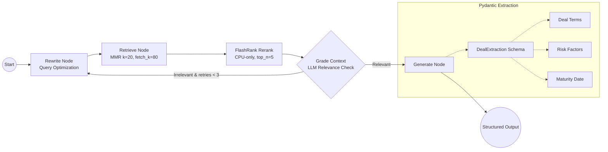
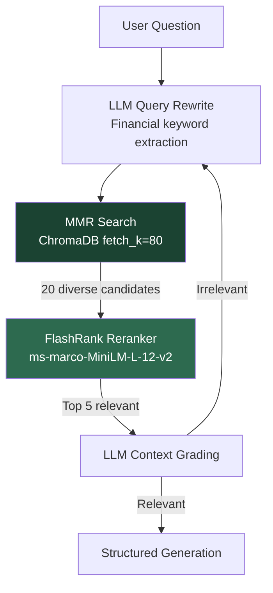

# Secure Financial Deal Analyzer (Local-First PoC)

A high-performance, agentic RAG pipeline designed to automate the extraction of critical financial terms and assess risks in unstructured corporate contracts and credit agreements.

This is a **Local-First Proof of Concept (PoC)**, architected with a modular, scalable foundation for future enterprise deployment.

## Core Architecture

This pipeline operates as a multi-container Docker application, ensuring service isolation and local air-gapped security. All configuration is centralized through **Pydantic `BaseSettings`** with environment variable overrides.



## Ingestion Pipeline

Documents are processed through a multi-stage ingestion pipeline with PII masking, two-stage semantic chunking, and idempotent storage.



## Deal Analyzer Logic (LangGraph)

The agent utilizes a self-correcting state machine with **MMR retrieval** and **FlashRank cross-encoder reranking** for precise financial data extraction.



## Retrieval Pipeline Detail

The retrieval stage uses a three-layer strategy to maximize precision on low-VRAM hardware:



| Layer | Technique | Purpose | VRAM |
|:------|:----------|:--------|:-----|
| 1 | **MMR** (Maximum Marginal Relevance) | Fetches 80 candidates, selects 20 diverse results | 0 (post-processing) |
| 2 | **FlashRank** Cross-Encoder | Reranks 20 candidates by query-document relevance, keeps top 5 | 0 (CPU-only, 22MB ONNX) |
| 3 | **LLM Grading** | Validates final context relevance, retries up to 3x | Shared with LLM |

## Low-VRAM Optimization

Designed to run on consumer hardware with **8GB VRAM** (e.g., NVIDIA RTX 3070 Ti).

| Component | VRAM | Notes |
|:----------|:-----|:------|
| Llama 3.1 (8B, Q4_K_M) | ~5 GB | LLM inference via Ollama |
| mxbai-embed-large (F16) | ~1.2 GB | Embeddings (shared: chunking + retrieval) |
| FlashRank reranker | 0 | CPU-only ONNX model (22MB RAM) |
| ChromaDB | 0 | Separate container |
| **Total** | **~6.2 GB** | Headroom for OS and Streamlit |

## Key Capabilities

* **Structured Financial Extraction:** Guarantees JSON-structured responses via Pydantic `DealExtraction` schema (Terms, Risks, Maturity), removing LLM hallucination in quantitative data.
* **Two-Stage Semantic Chunking:** Embedding-based `SemanticChunker` preserves document section boundaries (e.g., keeps "Maturity Date" with its clause), with `RecursiveCharacterTextSplitter` as a size-cap fallback for oversized sections.
* **Cross-Encoder Reranking:** FlashRank `ms-marco-MiniLM-L-12-v2` scores query-document pairs directly for superior precision over bi-encoder similarity alone.
* **Self-Correction Loop:** LangGraph state machine with typed `QueryStatus` enum autonomously grades retrieval relevance and rewrites queries up to 3 times.
* **Incremental Sync:** SQLite SHA-256 hash tracking ensures only new or modified contracts are processed.
* **Dependency Injection:** All configuration via `Pydantic BaseSettings` with `functools.partial` for testable LangGraph nodes. Zero `os.getenv()` scatter.
* **XSS-Safe Rendering:** All user-controlled content HTML-escaped before rendering with `unsafe_allow_html`.
* **RBAC Groundwork:** Every chunk tagged with `access_group` metadata for future enterprise role-based access control.

## Project Structure

```
fin-doc-rag-pipeline/
├── app/
│   └── main.py                    # Streamlit UI + chat interface
├── src/
│   ├── config.py                  # Pydantic BaseSettings (centralized config)
│   ├── ingestion/
│   │   ├── document_processor.py  # PDF extraction + Presidio PII masking
│   │   └── hash_tracker.py        # SQLite SHA-256 ingestion tracker
│   └── rag/
│       ├── chroma_deal_store.py   # ChromaDB wrapper + semantic chunking
│       └── deal_analyzer.py       # LangGraph agent + FlashRank reranking
├── tests/                         # 57 tests across 9 test files
│   ├── test_agent_routing.py      # LangGraph routing + settings injection
│   ├── test_chroma_deal_store.py  # Batch processing + metadata integrity
│   ├── test_document_deletion.py  # Targeted document purge
│   ├── test_document_processor.py # PII masking validation
│   ├── test_end_to_end_ingestion.py  # Full lifecycle integration test
│   ├── test_hash_tracker.py       # SHA-256 tracker determinism
│   ├── test_retrieval_quality.py  # MMR config + reranker integration
│   ├── test_semantic_chunking.py  # Two-stage chunking + fallback
│   └── test_transparency_logic.py # UI bug fix regression tests
├── scripts/
│   └── evaluate_ragas.py          # RAGAS evaluation framework
├── docs/
│   ├── ROADMAP.md                 # Release tracking
│   └── ADRs/                      # Architecture Decision Records (10)
├── docker-compose.yml
├── pyproject.toml                 # Build config + pytest settings
└── .env.local                     # Environment overrides
```

## Enterprise Scaling Strategy

While this PoC is optimized for local air-gapped development, the modular architecture is **100% compatible** with horizontal scaling in **Red Hat OpenShift** or **AWS/Azure Kubernetes**.

By swapping environment variables, the system can transition to managed services like **AWS Bedrock/Azure OpenAI** and **Managed pgvector (RDS)** while maintaining strict VPC isolation. See [ADR 0008: Scaling Roadmap](docs/ADRs/0008-local-poc-to-cloud-scaling.md) for details.

## Getting Started

### 1. Prerequisites
* **Docker & Docker Compose** installed.
* **NVIDIA Container Toolkit** (for local GPU acceleration).
* **Ollama Models:** Ensure you have pulled `llama3.1` and `mxbai-embed-large` via Ollama.

### 2. Setup & Launch
```bash
git clone https://github.com/mkazemicent/fin-deal-analyzer-poc.git
cd fin-deal-analyzer-poc

# 1. Initialize configuration
cp .env.example .env.local

# 2. Fix data volume permissions for the non-root 'appuser' (UID 1000)
sudo chown -R 1000:1000 ./data
sudo chmod -R 775 ./data

# 3. Launch the complete stack
docker-compose up -d --build
```
*Access the dashboard at `http://localhost:8501`*

### 3. Analyzing Your First Deal
1. **Upload:** Use the **Streamlit Sidebar** to upload a PDF contract (e.g., a Credit Agreement).
2. **Process:** Click **Process & Embed**. The system will mask PII, semantically chunk the text, and index it into ChromaDB.
3. **Analyze:** Ask a question in the chat (e.g., "What is the maturity date and interest margin?").
4. **Review:** See the **Structured Deal Analysis Results** and expand the **Retrieval Transparency** section to see exactly which chunks the AI used.

## Useful Commands

| Task | Command |
|:-----|:--------|
| **Bulk Masking** | `docker exec -it deal-analyzer-app python -m src.ingestion.document_processor` |
| **Bulk Indexing** | `docker exec -it deal-analyzer-app python -m src.rag.chroma_deal_store` |
| **Reset & Re-ingest** | `python -c "from src.rag.chroma_deal_store import ChromaDealStore; s=ChromaDealStore(); s.reset_collection(); s.initialize_deal_store()"` |
| **Run Tests (57)** | `pytest tests/ -v` |
| **Check Logs** | `docker logs deal-analyzer-app -f` |
| **Restart App** | `docker-compose restart app` |

## Architecture Decision Records

| ADR | Title | Status |
|:----|:------|:-------|
| [0001](docs/ADRs/0001-local-vector-storage-and-pii-masking.md) | Local Vector Storage & PII Masking | Accepted |
| [0002](docs/ADRs/0002-orchestration-and-development-environment.md) | Orchestration & Development Environment | Accepted |
| [0003](docs/ADRs/0003-automated-evaluation-with-ragas.md) | Automated Evaluation with RAGAS | Accepted |
| [0004](docs/ADRs/0004-enterprise-data-governance.md) | Enterprise Data Governance | Accepted |
| [0005](docs/ADRs/0005-automated-testing-and-validation.md) | Automated Testing & Validation | Accepted |
| [0006](docs/ADRs/0006-role-based-access-control.md) | Role-Based Access Control | Accepted |
| [0007](docs/ADRs/0007-semantic-chunking.md) | Two-Stage Semantic Chunking | Superseded (v2) |
| [0008](docs/ADRs/0008-local-poc-to-cloud-scaling.md) | Local PoC to Cloud Scaling | Proposed |
| [0009](docs/ADRs/0009-centralized-configuration.md) | Centralized Configuration & Dependency Injection | Accepted |
| [0010](docs/ADRs/0010-retrieval-quality-pipeline.md) | MMR + FlashRank Retrieval Pipeline | Accepted |

---
*Developed for Tier-1 Financial Compliance. Local-First. Air-Gapped. GPU-Optimized.*
