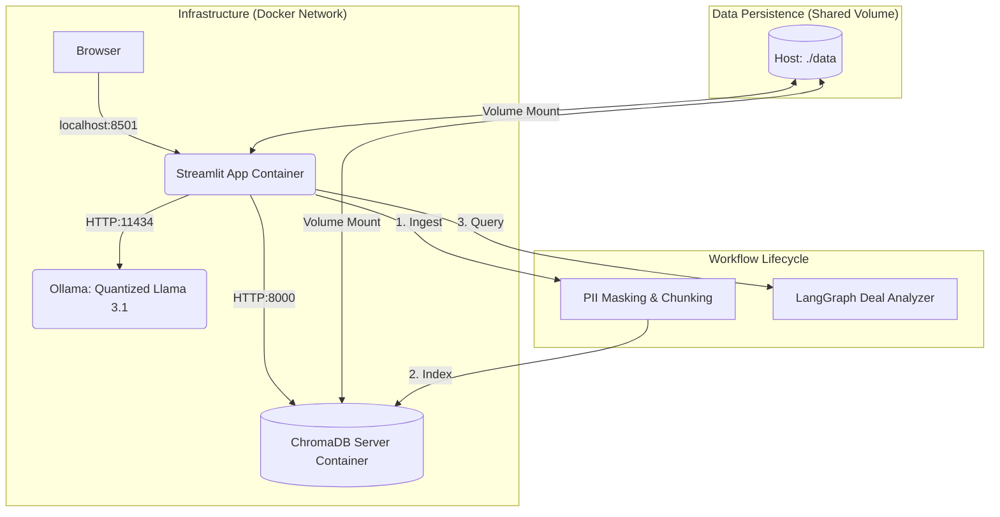
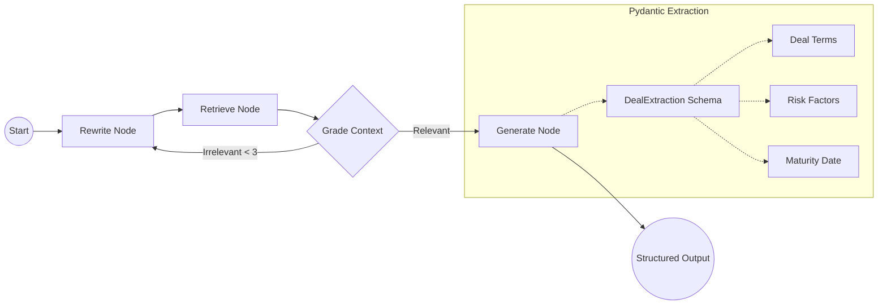

# 🏦 Secure Financial Deal Analyzer (Local-First PoC)

A high-performance, agentic RAG pipeline designed to automate the extraction of critical financial terms and assess risks in unstructured corporate contracts and credit agreements. 

This is a **Local-First Proof of Concept (PoC)**, architected with a modular, scalable foundation for future enterprise deployment.

## 🏗️ Core Architecture
This pipeline operates as a multi-container Docker application, ensuring service isolation and local air-gapped security.



## 🧠 Deal Analyzer Logic (LangGraph)
The agent utilizes a self-correcting state machine to ensure precise financial data extraction from unstructured text.



## 💎 Low-VRAM Optimization
This project is specifically designed to run on consumer hardware with **8GB - 12GB VRAM** (e.g., NVIDIA RTX 3070 Ti). 

*   **Inference:** Utilizes **4-bit/8-bit Quantized Llama 3.1** via Ollama to maximize speed while minimizing memory usage.
*   **Embeddings:** Employs **`mxbai-embed-large`**, a state-of-the-art embedding model that provides high-performance retrieval with a very low footprint.
*   **Memory Management:** Implements efficient batch processing (50 chunks per batch) during ingestion to prevent GPU memory overflows.

## 🚀 Key Capabilities
*   **Structured Financial Extraction:** Guarantees JSON-structured responses via Pydantic `DealExtraction` (Terms, Risks, Maturity), removing LLM hallucination in quantitative data.
*   **Self-Correction Loop:** Uses a **LangGraph State Machine** that autonomously grades retrieval relevance and rewrites queries for financial precision.
*   **Incremental Sync:** Integrated **SQLite Hash Tracking** ensures that only new or modified contracts are processed, saving significant compute time.
*   **RBAC Groundwork:** Every document chunk is injected with `access_group` metadata during ingestion for future enterprise role-based access control.

## 🚀 Enterprise Scaling Strategy
While this PoC is optimized for local air-gapped development, the modular architecture is **100% compatible** with horizontal scaling in **Red Hat OpenShift** or **AWS/Azure Kubernetes**. 

By simply swapping environment variables, the system can transition to managed services like **AWS Bedrock/Azure OpenAI** and **Managed pgvector (RDS)** while maintaining strict VPC isolation. See [ADR 0008: Scaling Roadmap](docs/ADRs/0008-local-poc-to-cloud-scaling.md) for details.

## 🛠️ Getting Started (How to Use)

### 1. Prerequisites
*   **Docker & Docker Compose** installed.
*   **NVIDIA Container Toolkit** (for local GPU acceleration).
*   **Ollama Models:** Ensure you have pulled `llama3.1` and `mxbai-embed-large` via Ollama.

### 2. Setup & Launch
```bash
git clone https://github.com/mkazemicent/fin-deal-analyzer-poc.git
cd fin-deal-analyzer-poc

# 1. Initialize configuration
cp .env.example .env.local

# 2. Critical: Fix data volume permissions for the non-root 'appuser' (UID 1000)
sudo chown -R 1000:1000 ./data
sudo chmod -R 775 ./data

# 3. Launch the complete stack
docker-compose up -d --build
```
*Access the dashboard at `http://localhost:8501`*

### 3. Analyzing Your First Deal
1.  **Upload:** Use the **Streamlit Sidebar** to upload a PDF contract (e.g., a Credit Agreement).
2.  **Process:** Click **🚀 Process & Embed**. The system will mask PII, chunk the text, and index it into the vector database.
3.  **Analyze:** Ask a question in the chat (e.g., "What is the maturity date and interest margin?").
4.  **Review:** See the **Structured Deal Analysis Results** and expand the **Retrieval Transparency** section to see exactly which parts of the contract the AI used.

## 📂 Useful Commands
Use these commands inside the `deal-analyzer-app` container to manage the system via CLI:

| Task | Command |
| :--- | :--- |
| **Bulk Masking** | `docker exec -it deal-analyzer-app python -m src.ingestion.document_processor` |
| **Bulk Indexing** | `docker exec -it deal-analyzer-app python -m src.rag.chroma_deal_store` |
| **Run Unit Tests** | `docker exec -it deal-analyzer-app pytest tests/` |
| **Check Logs** | `docker logs deal-analyzer-app -f` |
| **Restart App** | `docker-compose restart app` |

---
*Developed for Tier-1 Financial Compliance. Local-First. Air-Gapped. GPU-Optimized.*
