# ADR 0005: Standardized Automated Testing and Validation Architecture

**Status:** Accepted (Updated v2.0)
**Date:** March 2026

## Context

Initial attempts at testing relied on fragile `sys.path` hacks within individual test files. This led to collection errors when running `pytest` from the project root and inconsistent import behavior between modules. Furthermore, we needed a strategy to validate complex agent routing, metadata preservation, UI security, and retrieval quality without dependency on a live GPU or local LLM.

## Decision

We have standardized the testing architecture by implementing a modern Python package structure with comprehensive mock-first coverage:

1. **`pyproject.toml` Configuration:** Established as the central configuration for `pytest`. It explicitly sets `pythonpath = ["."]` and defines the test directory, eliminating the need for `sys.path` injection in code.
2. **Package Designation:** Added `src/__init__.py` to officially designate the `src` directory as a Python package, ensuring consistent absolute imports (e.g., `from src.rag...`) across tests and production code.
3. **Mock-First Methodology:** Mandated the use of `unittest.mock` and `patch` for all LLM, Embedding, and ChromaDB calls. This ensures the test suite is deterministic, fast, and can run on CI/CD environments without specialized hardware.
4. **Coverage Guardrails:** Expanded from initial 71% statement coverage to comprehensive validation of all critical paths including retrieval quality, UI security, and semantic chunking.

## Test Suite Architecture

```mermaid
graph TD
    A[57 Tests / 9 Files] --> B[Agent Routing<br/>6 tests]
    A --> C[ChromaDB Store<br/>3 tests]
    A --> D[Document Deletion<br/>5 tests]
    A --> E[Document Processor<br/>5 tests]
    A --> F[End-to-End Ingestion<br/>1 test]
    A --> G[Hash Tracker<br/>8 tests]
    A --> H[Retrieval Quality<br/>6 tests]
    A --> I[Semantic Chunking<br/>6 tests]
    A --> J[Transparency & Security<br/>17 tests]

    B --> B1[Routing signals]
    B --> B2[Retry cap logic]
    B --> B3[Settings injection]

    H --> H1[FlashRank reranking]
    H --> H2[MMR config]
    H --> H3[Edge cases]

    I --> I1[Two-stage chunking]
    I --> I2[Size-cap fallback]
    I --> I3[Tracker reset]

    J --> J1[Transparency gating]
    J --> J2[DealExtraction serialization]
    J --> J3[XSS prevention]
    J --> J4[History routing signal]
```

## Test File Index

| File | Tests | Coverage Area |
|------|-------|--------------|
| `test_agent_routing.py` | 6 | LangGraph routing signals, retry cap, settings injection, grading node |
| `test_chroma_deal_store.py` | 3 | Metadata preservation, batch resilience with SemanticChunker mock, settings usage |
| `test_document_deletion.py` | 5 | Tracker removal, nonexistent file handling, metadata normalization, ChromaDB delete mock |
| `test_document_processor.py` | 5 | Presidio PII masking (email, phone, person), organization retention, empty string |
| `test_end_to_end_ingestion.py` | 1 | Full lifecycle: load → PII mask → chunk → embed → track (all mocked) |
| `test_hash_tracker.py` | 8 | SQLite CRUD, SHA-256 determinism, content change detection, persistence across reconnect |
| `test_retrieval_quality.py` | 6 | FlashRank reranker compression, no-reranker passthrough, MMR config, irrelevant query skip |
| `test_semantic_chunking.py` | 6 | Two-stage chunking logic, size-cap fallback, metadata preservation, empty section filtering, tracker reset |
| `test_transparency_logic.py` | 17 | Routing signal gating (6), DealExtraction serialization (3), XSS escaping (4), history re-render gating (4) |

## Key Testing Patterns

### 1. Dependency Isolation via `unittest.mock.patch`
All external services (Ollama, ChromaDB, FlashRank, SemanticChunker) are mocked at the module boundary. Tests validate logic flow without network or GPU dependencies.

### 2. Settings Injection for Test Isolation
Tests inject custom `Settings(data_dir=tmp_path)` instances to isolate file system side effects using pytest's `tmp_path` fixture.

### 3. SemanticChunker Mock Strategy
SemanticChunker is mocked to return oversized text (`"x" * 2000`) which triggers the size-cap fallback path, ensuring both chunking stages are exercised without requiring embedding model calls.

### 4. Transparency Logic Unit Testing
UI security tests validate the `routing_signal`-based gating without requiring Streamlit. Pure function extraction allows testing transparency decisions, DealExtraction serialization, and XSS escaping independently.

## Consequences

### Positive
* **Developer Productivity:** `python -m pytest tests/ -v` runs all 57 tests in ~3 seconds with zero external dependencies.
* **Operational Reliability:** Guaranteed validation of governance features (hash tracking, PII masking), retrieval quality (MMR, reranking), and UI security (XSS, transparency gating) on every build.
* **Portability:** The testing framework runs on CI/CD without GPU, Ollama, or ChromaDB server.
* **Regression Safety:** SemanticChunker fallback, batch processing resilience, and routing signal propagation are all covered.

### Negative
* **Mock Maintenance:** Changes to `chroma_deal_store.py` or `deal_analyzer.py` signatures require updating mocks across multiple test files.
* **No Integration Tests:** Current suite validates logic in isolation. Live integration testing (Ollama + ChromaDB + FlashRank) requires manual verification.
