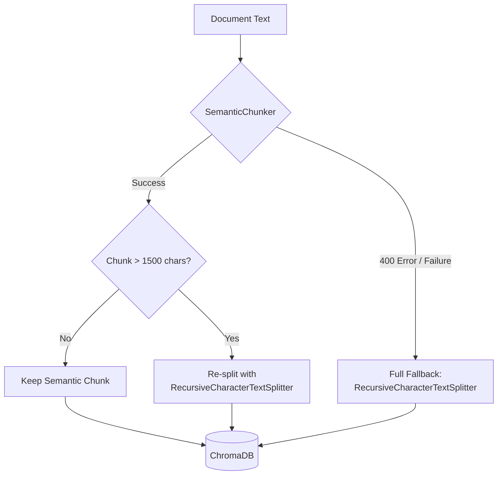

# ADR 0007: Two-Stage Semantic Chunking Strategy

**Status:** Accepted (Superseded v1 — March 2026)
**Date:** March 2026

## Context

The v1.0 chunking strategy used `RecursiveCharacterTextSplitter` exclusively (800 chars, 150 overlap). While reliable, this approach splits financial documents at arbitrary character boundaries, often breaking mid-section. For example, a "Maturity Date" clause could be split away from its section header, causing the retriever to return topically relevant but informationally incomplete chunks.

The original `SemanticChunker` was rejected in v1.0 because it exceeded the 512-token context window of `mxbai-embed-large` on large documents (>50KB), causing `400 Bad Request` errors.

## Decision

We have implemented a **two-stage chunking strategy** that combines the semantic awareness of embedding-based splitting with the reliability of character-based splitting:

**Stage 1 -- SemanticChunker (embedding-based boundary detection):**
- Uses `mxbai-embed-large` embeddings via `langchain-experimental` to detect topic shifts
- `breakpoint_threshold_type="percentile"`, `breakpoint_threshold_amount=70`
- Preserves section boundaries (e.g., keeps "Maturity Date" with its clause)

**Stage 2 -- Size-cap fallback:**
- If any semantic chunk exceeds `max_chunk_size` (1500 chars), it is re-split using `RecursiveCharacterTextSplitter` (800 chars, 150 overlap)
- If `SemanticChunker` fails entirely (e.g., document exceeds 512-token context window), the full document text falls back to `RecursiveCharacterTextSplitter`

### Configuration (src/config.py)

| Setting | Default | Purpose |
|:--------|:--------|:--------|
| `chunk_size` | 800 | Fallback splitter chunk size |
| `chunk_overlap` | 150 | Fallback splitter overlap |
| `max_chunk_size` | 1500 | Threshold to trigger re-splitting |
| `semantic_threshold` | 70 | Percentile breakpoint for SemanticChunker |

## Consequences

### Positive
* **Section Preservation:** Financial section boundaries are maintained for small/medium documents, improving retrieval precision for field-specific queries (maturity dates, covenants, etc.).
* **Graceful Degradation:** Large documents that exceed the embedding context window automatically fall back to the proven v1.0 strategy with zero data loss.
* **Zero Additional VRAM:** SemanticChunker reuses the existing `mxbai-embed-large` embeddings already loaded for retrieval.

### Negative
* **Ingestion Latency:** SemanticChunker requires embedding API calls per document (~0.6s for 3KB, scales linearly). Mitigated by the fact that ingestion is a one-time batch operation.
* **Non-deterministic Boundaries:** Semantic chunk boundaries depend on embedding similarity thresholds, which may vary slightly across model versions.

### Observed Production Results (7 documents)

| Document Size | Strategy Used | Chunks |
|:--------------|:-------------|:-------|
| < 3KB | Semantic | 3-7 |
| ~64KB | Semantic + size-cap | 167 |
| > 58KB | Fallback (exceeded 512 tokens) | 88-357 |
