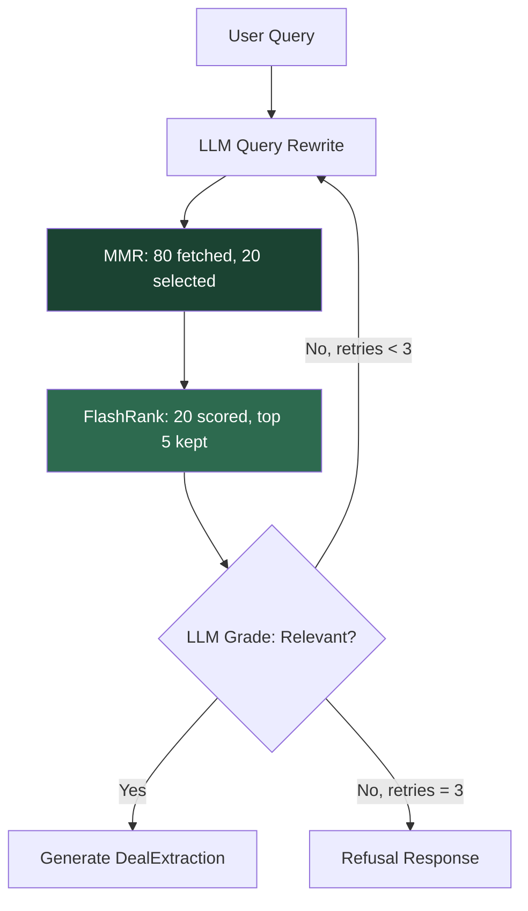

# ADR 0010: MMR + FlashRank Retrieval Quality Pipeline

**Status:** Accepted
**Date:** March 2026

## Context

The v1.0 retrieval pipeline used pure similarity search (`Chroma.as_retriever(search_kwargs={"k": 8})`). This had three weaknesses:

1. **Redundancy:** 8 chunks returned by cosine similarity often paraphrased the same section, wasting context window budget.
2. **No precision scoring:** All 8 chunks were treated equally, regardless of actual relevance to the question.
3. **Missed exact matches:** Vector search underweights exact financial terms (e.g., "Maturity Date", "SOFR", "2.50%") compared to semantic paraphrases.

This led to the user-reported issue: "What is the maturity date?" returned chunks about the deal but the specific maturity clause was not in the top 8.

## Decision

We have implemented a three-layer retrieval pipeline that maximizes precision within the 8GB VRAM budget of a 3070 Ti:

### Layer 1: MMR (Maximum Marginal Relevance)

```python
self.vectorstore.as_retriever(
    search_type="mmr",
    search_kwargs={"k": 20, "fetch_k": 80, "lambda_mult": 0.7}
)
```

- Fetches 80 embedding candidates from ChromaDB
- Selects 20 that balance **relevance** (0.7) and **diversity** (0.3)
- Ensures coverage of different document sections instead of 20 paraphrases of the same paragraph
- **VRAM impact:** Zero (post-processing on already-computed embeddings)

### Layer 2: FlashRank Cross-Encoder Reranking

```python
from langchain_community.document_compressors import FlashrankRerank
reranker = FlashrankRerank(model="ms-marco-MiniLM-L-12-v2", top_n=5)
```

- Takes 20 MMR candidates and scores each against the **original user question** (not the rewritten query)
- Keeps the top 5 most relevant chunks
- Cross-encoder architecture scores query-document pairs jointly (more accurate than bi-encoder cosine similarity)
- **VRAM impact:** Zero (CPU-only ONNX model, 22MB)

### Layer 3: LLM Context Grading (existing)

- LLM grades whether the final 5 chunks are relevant to the question
- If irrelevant, rewrites the query and retries (up to 3 times)



### VRAM Budget

| Component | VRAM | Notes |
|:----------|:-----|:------|
| Llama 3.1 (Q4_K_M) | ~5 GB | LLM inference |
| mxbai-embed-large | ~1.2 GB | Embeddings |
| FlashRank reranker | 0 | CPU-only (22MB RAM) |
| **Total** | **~6.2 GB** | Within 8GB budget |

### Configuration (src/config.py)

| Setting | Default | Purpose |
|:--------|:--------|:--------|
| `retriever_k` | 20 | MMR candidates to keep |
| `mmr_lambda` | 0.7 | Relevance vs. diversity balance |
| `rerank_top_n` | 5 | Chunks after reranking |
| `reranker_model` | ms-marco-MiniLM-L-12-v2 | FlashRank cross-encoder model |

## Consequences

### Positive
* **Higher retrieval precision:** Cross-encoder reranking consistently surfaces the most relevant chunks for field-specific queries.
* **Better diversity:** MMR prevents redundant chunks from consuming the LLM context window.
* **Zero VRAM overhead:** Both MMR and FlashRank run without GPU memory, keeping the pipeline within 3070 Ti constraints.
* **Configurable:** All retrieval parameters exposed via `Settings` for environment-specific tuning.

### Negative
* **Latency:** FlashRank reranking adds ~0.5s per query (CPU inference on 20 documents). Acceptable for interactive use.
* **Additional dependency:** `flashrank` and `rank-bm25` packages added to `pyproject.toml`.
* **Re-ingestion required:** Changing `retriever_k` or `mmr_lambda` does not require re-ingestion. Changing chunking parameters does (use `ChromaDealStore.reset_collection()`).
