# Enterprise Deal Analyzer — Architecture Roadmap

> Air-gapped RAG system for Canadian corporate contract analysis.
> Designed for OSFI-regulated environments with zero external API dependencies.

This roadmap documents the architectural evolution from local PoC to enterprise-grade deployment, tracking decisions, trade-offs, and the engineering rationale behind each phase.

---

## Architecture Evolution

```mermaid
graph LR
    V1["v1.0<br/>Foundation"]
    V2["v2.0<br/>Retrieval Quality"]
    V3["v3.0<br/>Hybrid Search &<br/>Evaluation"]
    V4["v4.0<br/>Observability &<br/>Resilience"]
    V5["v5.0<br/>Production<br/>Deployment"]
    V6["v6.0<br/>Enterprise<br/>Scale"]

    V1 -->|"Semantic chunking<br/>MMR + reranking"| V2
    V2 -->|"BM25 fusion<br/>RBAC enforcement"| V3
    V3 -->|"OTel tracing<br/>Circuit breakers"| V4
    V4 -->|"Helm + K8s<br/>Async ingestion"| V5
    V5 -->|"pgvector<br/>Multi-tenant"| V6

    style V1 fill:#2d6a4f,stroke:#1b4332,color:#fff
    style V2 fill:#2d6a4f,stroke:#1b4332,color:#fff
    style V3 fill:#40916c,stroke:#2d6a4f,color:#fff
    style V4 fill:#52b788,stroke:#40916c,color:#000
    style V5 fill:#74c69d,stroke:#52b788,color:#000
    style V6 fill:#95d5b2,stroke:#74c69d,color:#000
```



---

## v1.0 — Foundation (Completed)

**Goal:** Prove an air-gapped RAG pipeline can extract structured deal terms from Canadian corporate contracts using only local infrastructure.

| Capability | Implementation | ADR |
|:-----------|:--------------|:----|
| **Zero-Trust Ingestion** | Microsoft Presidio PII masking (PERSON, EMAIL, PHONE, IBAN, US_BANK_NUMBER) with SpaCy `en_core_web_lg` | [0001](ADRs/0001-local-vector-storage-and-pii-masking.md) |
| **Air-Gapped Vector DB** | ChromaDB client-server with `mxbai-embed-large` (1024-dim, 512-token) | [0001](ADRs/0001-local-vector-storage-and-pii-masking.md) |
| **Agentic Reasoning** | LangGraph state machine: rewrite → retrieve → grade → generate with autonomous retry loop | [0002](ADRs/0002-orchestration-and-development-environment.md) |
| **Data Governance** | SQLite SHA-256 hash tracking for incremental ingestion and deduplication | [0004](ADRs/0004-enterprise-data-governance.md) |
| **Validation** | 28 tests, 71% statement coverage, `pytest` + `pyproject.toml` standardization | [0005](ADRs/0005-automated-testing-and-validation.md) |
| **Enterprise UI** | Streamlit dashboard with infrastructure health checks and retrieval transparency cards | — |
| **Chunking** | `RecursiveCharacterTextSplitter` (800 chars / 150 overlap) | [0007](ADRs/0007-semantic-chunking.md) |

**Containerized Stack:** Docker Compose with 3 services (app, ChromaDB, Ollama) on a bridge network. NVIDIA GPU passthrough for `llama3.1` inference.

---

## v2.0 — Retrieval Quality & Code Maturity (Completed)

**Goal:** Solve the "Not found in document" problem where fixed-size chunking splits financial sections mid-sentence, causing the retriever to miss specific fields like maturity dates.

### Retrieval Quality
- [x] **Two-Stage Semantic Chunking:** `SemanticChunker` (embedding-based boundary detection, percentile threshold=70) preserves financial section boundaries. `RecursiveCharacterTextSplitter` size-cap fallback (1500 chars) prevents oversized chunks. ([ADR 0007](ADRs/0007-semantic-chunking.md))
- [x] **MMR Diversity Search:** Maximum Marginal Relevance (`fetch_k=80`, `k=20`, `lambda_mult=0.7`) replaces pure similarity search, eliminating redundant chunks that repeat the same paragraph. ([ADR 0010](ADRs/0010-retrieval-quality-pipeline.md))
- [x] **Cross-Encoder Reranking:** FlashRank `ms-marco-MiniLM-L-12-v2` (CPU-only, 22MB ONNX) reranks 20 MMR candidates to top 5 by query-document relevance. Zero VRAM cost. ([ADR 0010](ADRs/0010-retrieval-quality-pipeline.md))

### Architecture & Code Quality
- [x] **Centralized Configuration:** Pydantic `BaseSettings` replaces 20+ scattered `os.getenv()` calls. Single source of truth with typed validation and `.env.local` override. ([ADR 0009](ADRs/0009-centralized-configuration.md))
- [x] **Dependency Injection:** `functools.partial` binds shared LLM/retriever/reranker instances into LangGraph nodes. LLM created once per `build_deal_analyzer()`, not per query. ([ADR 0009](ADRs/0009-centralized-configuration.md))
- [x] **Typed Routing Signals:** `QueryStatus(str, Enum)` with `RELEVANT`, `IRRELEVANT`, `ERROR` values replaces fragile string matching for state machine routing decisions.

### UI Security
- [x] **Transparency Gating:** `routing_signal == "relevant"` gates retrieval transparency display. Refusal answers no longer leak document metadata.
- [x] **XSS Prevention:** `html.escape()` on all user-controlled content rendered with `unsafe_allow_html=True`.
- [x] **DealExtraction Serialization:** Human-readable text in chat history instead of raw Pydantic `repr()`.
- [x] **History Routing Signal:** `routing_signal` persisted in message data for correct page-reload re-rendering.

### Testing
- [x] **57 Tests, 9 Test Files:** Doubled from 28 tests. New coverage: semantic chunking logic, FlashRank reranker integration, MMR config validation, transparency gating (6 scenarios), XSS escaping (4 vectors), DealExtraction serialization (3 cases), history routing (4 cases). ([ADR 0005](ADRs/0005-automated-testing-and-validation.md))

### VRAM Budget (3070 Ti = 8 GB)

| Component | VRAM | Notes |
|:----------|:-----|:------|
| llama3.1 (8B, Q4_K_M) | ~5.0 GB | LLM inference via Ollama |
| mxbai-embed-large | ~1.2 GB | Embeddings (shared: chunking + retrieval) |
| FlashRank reranker | 0 | CPU-only ONNX, 22 MB RAM |
| ChromaDB | 0 | Separate container |
| **Total** | **~6.2 GB** | 1.8 GB headroom |

---

## v3.0 — Hybrid Search & Evaluation Maturity (Next)

**Goal:** Close the retrieval gap for exact-match financial terms that vector search underweights (e.g., "SOFR", "CORRA", "2.50%"), and establish automated quality gates.

### Retrieval Enhancements
- [ ] **BM25 Hybrid Search:** Combine BM25 keyword scores with vector similarity using Reciprocal Rank Fusion. `rank-bm25` already in dependencies. Critical for financial terms with precise decimal values that embedding models compress into semantic space.
  ```
  Pipeline: query → [BM25 top-20] + [MMR top-20] → RRF merge → FlashRank rerank → top-5
  ```
- [ ] **Metadata Pre-filtering:** Enforce `access_group` filters at query time. Wire user role from Streamlit session → `AgentState.user_role` → ChromaDB `where` clause. This activates the RBAC architecture defined in [ADR 0006](ADRs/0006-role-based-access-control.md) that currently only tags documents without filtering.

### Evaluation & Quality Gates
- [ ] **RAGAS Evaluation Expansion:** Grow from 3 to 50+ ground-truth Q&A pairs covering maturity dates, covenants, risk factors, interest rates, and cross-deal comparisons. Add `context_precision` and `context_recall` metrics alongside existing `faithfulness` and `answer_relevancy`.
- [ ] **Evaluation Regression Tracking:** Store metrics in `data/eval_history/` with timestamps. Alert on >5% degradation from baseline on any metric.
- [ ] **CI/CD Pipeline:** GitHub Actions workflow — `pytest` (gate: 57+ tests pass), `ruff` (zero violations), coverage (gate: >80%), RAGAS regression check on PR merge.

### Files
`src/rag/chroma_deal_store.py`, `src/rag/deal_analyzer.py`, `scripts/evaluate_ragas.py`, `.github/workflows/ci.yml`

---

## v4.0 — Observability & Resilience (Planned)

**Goal:** Production-grade reliability and operational visibility. Every LangGraph node instrumented. External service failures handled gracefully.

### Observability
- [ ] **OpenTelemetry Tracing:** Instrument every LangGraph node (`rewrite`, `retrieve`, `grade_context`, `generate`) with spans. Trace the full retrieval → rerank → generation pipeline with per-node latency breakdowns. Export via OTLP to Jaeger or Datadog.
- [ ] **Prometheus Metrics:** Custom counters and histograms:
  - `rag_queries_total{routing_signal}` — query volume by outcome
  - `rag_retrieval_duration_seconds` — retrieval + reranking latency
  - `rag_reranker_effectiveness` — score distribution before/after reranking
  - `rag_llm_token_usage` — token consumption per query
- [ ] **Structured Logging:** Migrate from f-string `logger.info()` to `structlog` JSON output. Correlation IDs propagated across nodes. Machine-parseable for Splunk/ELK ingestion.

### Resilience
- [ ] **Retry Policies:** `tenacity` decorators on Ollama and ChromaDB calls with exponential backoff and jitter. Distinguish transient errors (network timeout, 503) from permanent errors (invalid model, malformed query).
- [ ] **Circuit Breakers:** `pybreaker` on external service calls. Half-open → closed recovery. Graceful degradation: return cached results or structured error when Ollama/ChromaDB is unhealthy.
- [ ] **Audit Logging:** Append-only SQLite `audit_log` table — `timestamp`, `user_id`, `query`, `document_ids[]`, `routing_signal`, `response_hash`. Supports OSFI audit trail requirements.

### Files
New `src/observability/` package, `src/rag/deal_analyzer.py`, `src/rag/chroma_deal_store.py`, `docker-compose.yml` (add Jaeger service)

---

## v5.0 — Production Deployment (Planned)

**Goal:** Kubernetes-native deployment with horizontal scaling, automated quality enforcement, and async document processing.

### Infrastructure
- [ ] **Helm Chart:** Kubernetes manifests for app, ChromaDB, and Ollama. ConfigMaps for environment-specific settings. Secrets for credentials. PersistentVolumeClaims for data persistence. GPU scheduling via `nvidia.com/gpu` resource limits. Target: Red Hat OpenShift compatibility per [ADR 0008](ADRs/0008-local-poc-to-cloud-scaling.md).
- [ ] **Health Probes:** Dedicated endpoints — `/health/live` (process alive), `/health/ready` (Ollama + ChromaDB connectivity verified), `/health/startup` (model loaded, collection initialized). Wire into Kubernetes liveness/readiness/startup probes.

### Processing
- [ ] **Async Ingestion:** Celery + Redis task queue for background PDF processing. Upload returns immediately with job ID. Progress tracking in Streamlit via polling. Dead-letter queue for documents that fail after 3 retries.

### Code Quality Gates
- [ ] **Pre-commit Hooks:** ruff lint + ruff format + mypy as `.pre-commit-config.yaml` hooks. No unformatted or untyped code reaches the repository.
- [ ] **mypy Strict Mode:** Full type checking on `src/` with `--strict`. Enforce return type annotations, disallow `Any`, warn on missing stubs.

### Files
`helm/deal-analyzer/`, `src/ingestion/tasks.py`, `.pre-commit-config.yaml`, `mypy.ini`

---

## v6.0 — Enterprise Scale (Future)

**Goal:** Multi-tenant, horizontally scalable, regulation-ready system for Tier-1 bank deployment.

### Data Layer
- [ ] **pgvector Migration:** Replace ChromaDB with PostgreSQL + pgvector for HA (streaming replication), ACID transactions, and native row-level security. Enables SQL-based metadata queries alongside vector similarity.
- [ ] **Document Summarization Index:** Secondary index of per-document summaries for portfolio-level queries ("Which deals mature in Q4 2026?") and cross-deal trend analysis.

### Security & Compliance
- [ ] **Multi-Tenant RBAC:** OAuth2/OIDC authentication via Azure AD or Okta. Per-user `access_group` enforcement at the database layer. Row-level security in pgvector ensures tenant isolation without application-level filtering.
- [ ] **Secrets Management:** Migrate from `.env` files to HashiCorp Vault or Azure Key Vault. 90-day rotation policy. No secrets in container images.

### Performance & Validation
- [ ] **Load Testing:** Locust or k6 scripts targeting 100 concurrent users. Establish latency baselines (P50, P95, P99) and maximum throughput under GPU saturation.
- [ ] **Multi-Region Deployment:** Active-passive with PostgreSQL streaming replication. Regional Ollama inference endpoints to minimize latency. DNS-based failover.

### Enterprise VRAM Targets

| Environment | GPU | VRAM | LLM | Embedding |
|:-----------|:----|:-----|:----|:----------|
| Development | RTX 3070 Ti | 8 GB | llama3.1 8B Q4 | mxbai-embed-large |
| Staging | RTX 4090 | 24 GB | llama3.1 70B Q4 | mxbai-embed-large |
| Production | A100 | 80 GB | llama3.1 70B FP16 | mxbai-embed-large |

---

## Architecture Decision Records

| ADR | Title | Status |
|:----|:------|:-------|
| [0001](ADRs/0001-local-vector-storage-and-pii-masking.md) | Local Vector Storage & PII Masking | Accepted |
| [0002](ADRs/0002-orchestration-and-development-environment.md) | Orchestration & Development Environment | Accepted |
| [0003](ADRs/0003-automated-evaluation-with-ragas.md) | Automated Evaluation with RAGAS | Accepted |
| [0004](ADRs/0004-enterprise-data-governance.md) | Enterprise Data Governance | Accepted |
| [0005](ADRs/0005-automated-testing-and-validation.md) | Automated Testing & Validation (57 tests) | Accepted (Updated v2.0) |
| [0006](ADRs/0006-role-based-access-control.md) | Role-Based Access Control | Accepted |
| [0007](ADRs/0007-semantic-chunking.md) | Two-Stage Semantic Chunking | Accepted (Updated v2.0) |
| [0008](ADRs/0008-local-poc-to-cloud-scaling.md) | Local PoC to Cloud Scaling | Proposed |
| [0009](ADRs/0009-centralized-configuration.md) | Centralized Configuration & Dependency Injection | Accepted |
| [0010](ADRs/0010-retrieval-quality-pipeline.md) | MMR + FlashRank Retrieval Quality Pipeline | Accepted |

---

*Enterprise Deal Analyzer v2.0 | March 2026*
